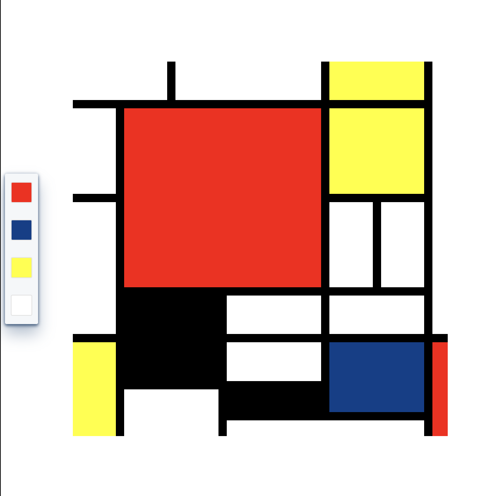

# Paint Like Mondrian

###  Based on Piet Mondrian's Composition in Red, Yellow and Blue (1929), it is a work done with CSS Grid.

###  The color palette can be moved around by dragging and areas can be painted with the selected color.

### https://bimelike.github.io/paintLikeMondrian/

